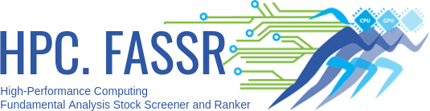

<h1 align="center">  
    
</h1>

<h3 align="center">High-Performance Computing. Fundamental Analysis Stock Screener and Ranker.</h3>

<b>
    <a href="https://github.com/kafkasl/hpc.fassr">Website</a> •  
</b>

## Introduction

We present HPC.FASSR, a High-Performance Computation Fundamental Analysis Stock Screening and Ranking system built on [PyCOMPSs](https://github.com/bsc-wdc/compss), to compare the performance of various supervised learning algorithms like neural networks, random forests, support vectors machines, or AdaBoost, and the criteria of famous expert trader Benjamin Graham for selecting stocks based on fundamental factors. 

The system is designed to work with models that follow scikit-learn model's API. To integrate custom models, they only need to implement sklearn's interface (essentially, _fit_ and _predict_ methods).

## Contributions

This work is part of the Master thesis: _A machine learning approach to stock screening with fundamental analysis_.
This work has been accepted for presentation at the International Conference on Computational Finance (ICCF 2019), A Coruña, July 8-12th, 2109.

## Performance 

We evaluate the economic and execution time performance of HPC.FASSR through 5 experiments.

We perform three experiments using financial data from companies of the S\&P 500 Index. First, we compare Graham's criteria with classification models in a stock screening scenario trading only long positions. Second, we examine the performance of regression against classification models, also in stock screening but allowing short positions. Finally, we use the predictions of the regression models to perform stock ranking instead of just stock screening. The results show that finding the right parametrizations for the models is critical to get the highest returns, but this requires significant amount of computing resources. Without the proper configuration, some models do not outperform the index, as Graham consistently does, or even manage to get into debt in scenarios where shorting is allowed. On the other, most models outperform both Graham's criteria and the index and the best configurations multiply the initial investment tenfold in stock screening, and almost by $200$ in stock ranking.

The parallelization of HPC.FASSR with PyCOMPSs allows us to explore a vast number of configurations in a short time. We evaluate its performance under strong and weak scaling scenarios in MareNostrum 4, the main supercomputer in the Barcelona Supercomputing Center, running with up to 1500 CPUs and training more than 50K models.

## Contributing

Contributions are **welcome and very much appreciated**. We are also open to starting research collaborations or mentoring if you are interested in or need assistance implementing new algorithms.

## License

Apache License Version 2.0, see [LICENSE](LICENSE)

